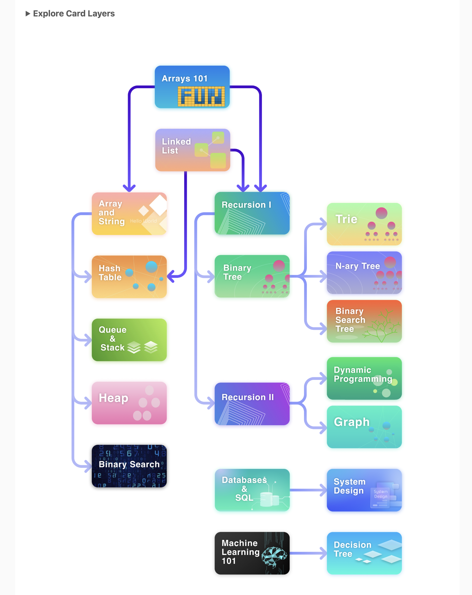

# Dockerizing this repo

- \$ docker build -t leetcode-node .
- \$ docker run --rm leetcode-node
- Instead just build and run once:
  - \$ docker build -t leetcode-node . && docker run --rm leetcode-node

## Track Choosen in LeetCode on CW24-2025

- Explore track: 
